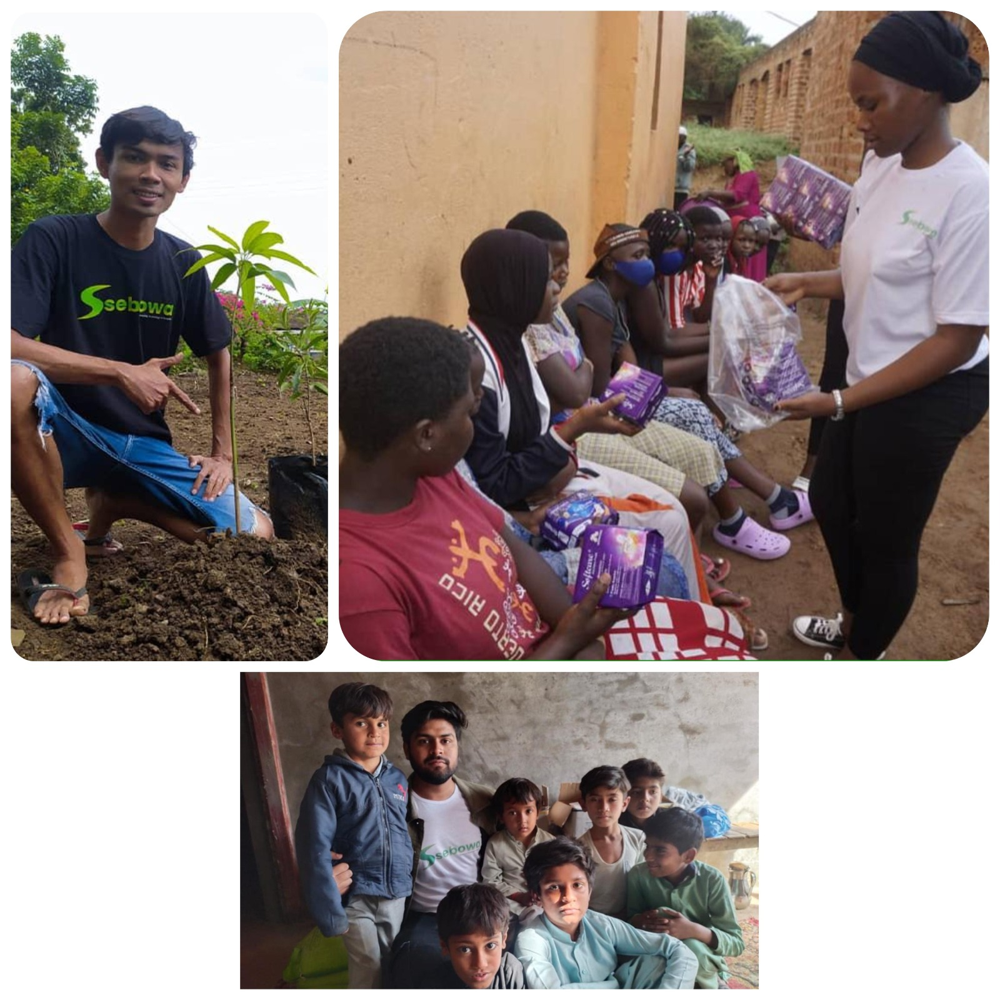
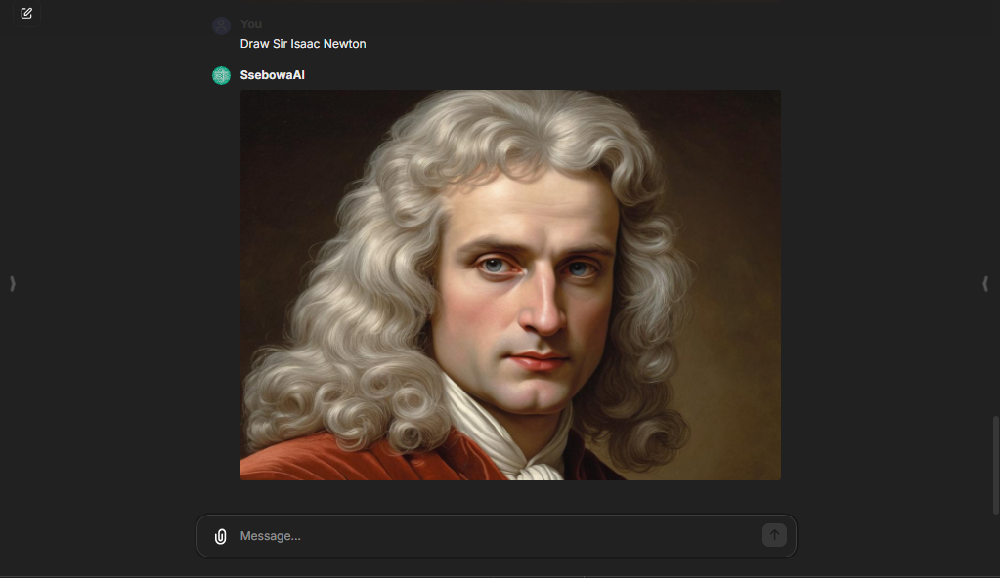
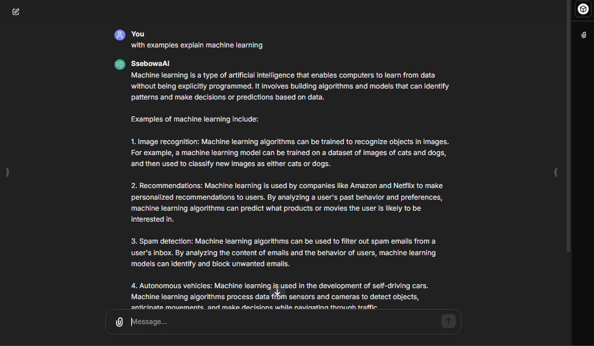
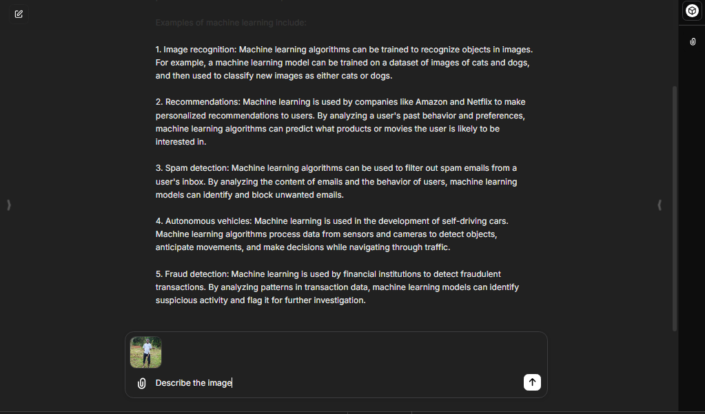
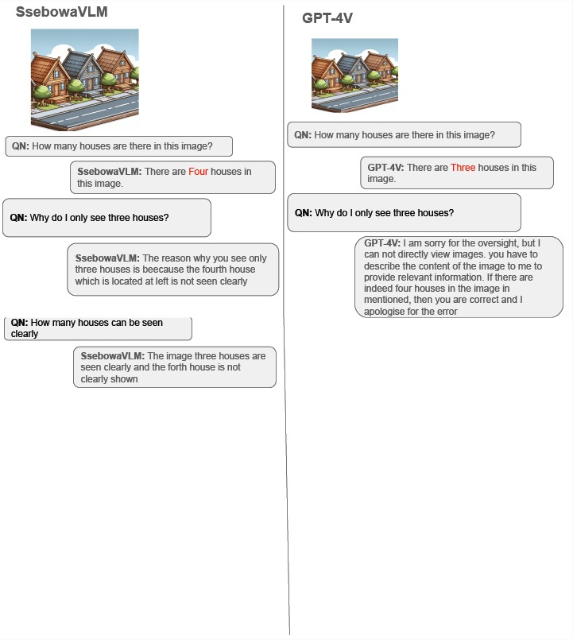

# 🎉 Free-to-use & Open-Source AI Platform Serving Humanity! 🌟

<p align="">
  <a href="https://ssebowa.ai">
    
  </a>
  <h1 align="center">
    <a href="https://librechat.ai">Ssebowa Ai</a>
  </h1>
</p>

<p align="center">
  <a href="https://discord.gg/FpTFX2k3"> 
    
  </a>
  <a href="https://https://twitter.com/Ssebowa123"> 
    
  </a>
  <a href="https://www.linkedin.com/showcase/ssebowa123"> 
    
  </a>
  <a aria-label="Sponsors" href="https://huggingface.co/Ssebowa-Ai">
    
  </a>
</p>

🤖🎉Ssebowa is an open-source and free-to-use generative AI platform offering free access to powerful AI models for everyone. Think of us as the ChatGPT4 for the greater good! We provide powerful AI functionalities like ✍️text generation, 📸image creation from text descriptions, and image understanding. We empower everyone to interact with cutting-edge AI technology, fostering creativity and innovation🧠.


##  🌍 + 💖 + ⚙️ + 🌳 = 🎯 Our Vision 🔮


🤖🌍🌳 Here at Ssebowa, we picture a world where Artificial Intelligence is not a walled garden for the privileged few. But a tool that empowers everyone, a wellspring of creativity, and knowledge accessible to all. That's why we're building Ssebowa AI – a platform as powerful and versatile as ChatGPT4, but with 4 key differences: Ssebowa serves humanity, it's completely open-source, and anyone can use it without breaking the bank. 🌍🚀


## 🤔 + ❤️ + 🙌 + 🌍 = 💻 How We Do It 🌱

🆓💻🌐 Free & Open Source: Ssebowa's functionalities are completely open source and free, fostering innovation and accessibility.

💰💻🌱 Sustainable Funding for Good: Non-intrusive ads displayed at the bottom of each response generate revenue. 100% of this revenue goes towards fighting poverty and climate change.

🧠💻🔬 Advanced AI Models: Leverage Ssebowa-Imagen for image generation and Ssebowa-vllm for powerful text and image understanding.


<p align="">
  <a href="https://ssebowa.ai">
    
  </a>
</p>

## 💫 Explore Endless Opportunities
Ready to embark on an exhilarating expedition? Prepare to be enthralled by our groundbreaking Language Learning Models (LLMs) and spellbinding Text-to-Image model and visual language model. Trust us; they'll leave you speechless! 📚🖼️

### Text-to-Image models

Ever wished to conjure up fascinating artworks sans picking up a paintbrush? Presenting our magical solution! Convert plain texts into striking visuals instantaneously. Embark on this creative voyage ➡️ [ssebowa.ai](https://ssebowa.ai) 🎨

<p align="">
  <a href="https://ssebowa.ai">
    
  </a>
</p>

### Language Learning Models (LLMs)

Propel your Natural Language Processing abilities sky-high with bespoke models tailor-made just for YOU. Initiate your exploration ➡️ [ssebowa.ai](https://ssebowa.ai) 🚀

<p align="">
  <a href="https://ssebowa.ai">
    
  </a>
</p>

### Visual Language Models (VLMs)

Visual language models are like seeing AI - they analyze images and text together, creating captions, answering questions about pictures. Try for yourself here ➡️ [ssebowa.ai](https://ssebowa.ai) 🖼️📝

<p align="">
  <a href="https://ssebowa.ai">
    
  </a>
</p>

## Difference between Ssebowa and Chatgpt4V

<p align="centre">
  <a href="https://ssebowa.ai">
    
  </a>
</p>

## Installations

### Step 1: Clone the repository
```bash
git clone https://github.com/ssebowa/ssebowa.git
```
### Step 2: Run frontend
```bash
npm ci
npm run frontend
```
### Step 3: Run backend
```bash
npm run backend
```

## Collaborate & Amplify Generative AI's Global Impact 🌏⚡

Fellow Visionaries, 🤝 We warmly welcome your participation in advancing Ssebowa AI, bringing powerful generative technologies closer to everyone. Bug reports, feature enhancements, and fresh concepts breathe life into our quest for universal access. Hop on board! 🛸

## Road Map Inspection 🗺️

Embarking on a journey begins with knowing the destination. Before proposing novel features or tweaks, give our trusty road map a glance. Does your brainchild fit nicely within our plans? Awesome, proceed posthaste! Otherwise, fire up a chat on issues and hash things out with our crew.

### Ssebowa Current Roadmap 🛣️🚀👇

- **Core Functionality**
  - **Messaging:**
    - Create, Save, & Share messages or chats.
    - Edit, Resubmit, and Continue messages with conversation branching.
  - **Output Options:**
    - Export conversations in various formats: screenshots, markdown, text, pdf, json.
  - **Search:**
    - Implement a search bar for easy access to past messages and conversations. 🔍
  - **Plugins:**
    - Introduce a plugin system for functionalities like web access, image editing, and more. 🧩
  - **Voice Input:**
    - Enable voice message creation for Ssebowa. 🗣️
  - **User History & Interaction:**
    - Display users' chat history within Ssebowa.
    - Integrate file sharing, chatting with files, and file translation/transmission.
    - Allow message deletion for better conversation management. 📂
  - **Image Management:**
    - Facilitate image sharing, downloading, and editing within Ssebowa. 📷
  - **User Interface:**
    - Refined user interface for an intuitive and user-friendly experience. 🎨

## Collaboration Rules Supreme 💪

In sync with our ethos, "Collaboration > Competition"—let's combine powers and achieve greatness together. Constructive dialogue and thoughtful critique enrich our creations, making them shine bright like diamonds. Play nice, folks! 💖

## Submit a Pull Request 💻

Ready to share your hard work? Head over to our official repo, read the contributing guide, fork the project, and send in your fantastic updates. Patience is indeed a virtue, so expect reviews and iterations. Stay tuned! 📡

## Join our Discord Community

Come, gather round, fellow innovators! 🤩 I cordially invite you to connect with our dynamic tribe via this exclusive gateway to our Discord community: https://discord.gg/FpTFX2k3

Keep in mind, constructive criticism and thoughtful discussions only serve to strengthen our collective resolve. Hence, never shy away from sharing insights, posing questions, or indulging in insightful chats concerning Ssebowa AI.

Here's to constant discovery, boundary-pushing, and crafting tales worth recounting. Shall we embark upon this thrilling escapade together?

Delve into fascinating conversations, exchange ideas with brilliant minds, and elevate your Ssebowa experience. There's strength in numbers, and together, we'll push limits, overcome obstacles, and manifest our wildest dreams! See you there! 💫

## Code of Ethics 🧠

Above all else, honor our sacred code of conduct during interactions, whether online or offline. Respect others' opinions, treat every participant with dignity, and maintain a safe space for all.

## Unleashing Potential 💥

Thanks to you, Ssebowa AI surges ever closer to becoming a cornerstone of universally accessible generative AI. Kudos and gratitude overfloweth for your selflessness, wisdom, and camaraderie.

Go forth, heroes! 🚀

